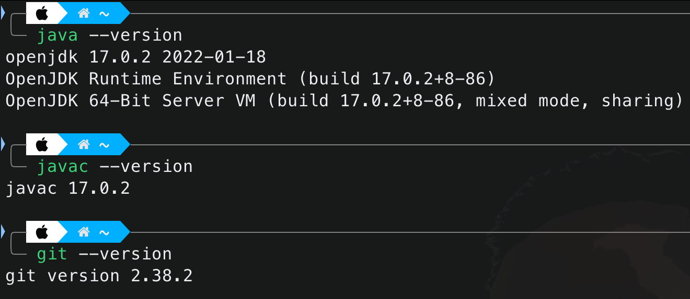
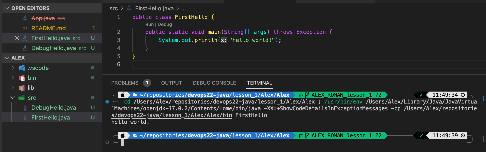
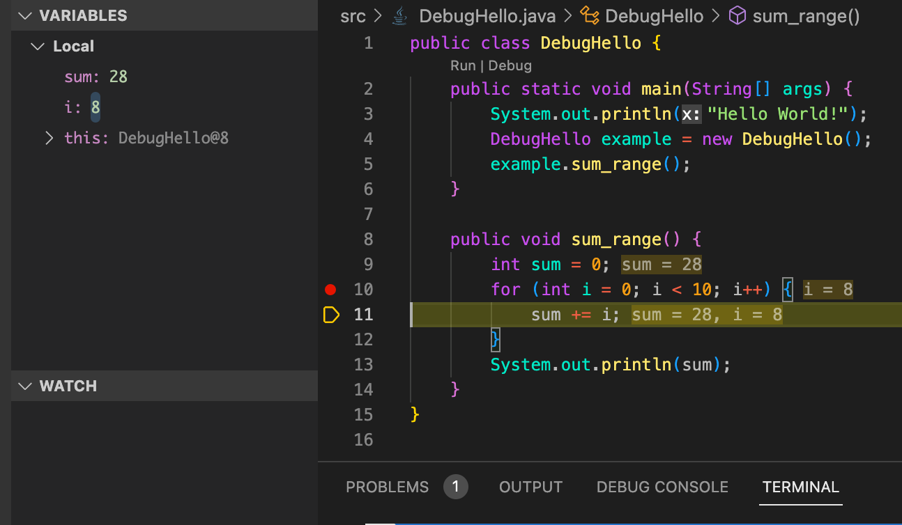

# Alex Roman - Lesson 1

Trying to learn how to create a Java project in Visual Studio Code. I have used VS Code for Python development, but I have never used it for Java. I used IntelliJ IDEA for Java development in the past.

## Screenshots

### Git and Java version

---

### First Hello

---

### Debug Hello

---
