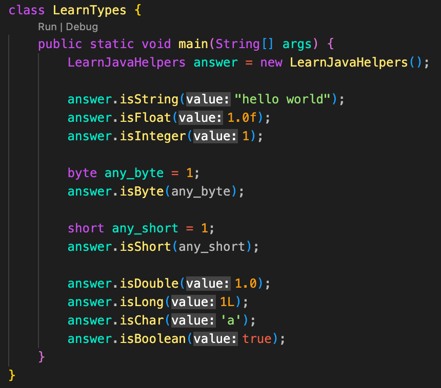

# Alex Roman - Lesson 2

The files are in the `lesson_2/Alex` directory. The folder `lesson_2/Alex/img` contains the images used in this document.

---

## Learn Defaults

### Code

```java
package lesson_2.exercise;

import lesson_2.exercise.common.LearnJavaHelpers;

class LearnDefaults {
    public static void main(String[] args) {
        LearnJavaHelpers answer = new LearnJavaHelpers();

        answer.trueOrThrow(LearnJavaHelpers.a_byte == 0);
        answer.trueOrThrow(LearnJavaHelpers.a_short == 0);
        answer.trueOrThrow(LearnJavaHelpers.a_int == 0);
        answer.trueOrThrow(LearnJavaHelpers.a_long == 0L);
        answer.trueOrThrow(LearnJavaHelpers.a_float == 0f);
        answer.trueOrThrow(LearnJavaHelpers.a_double == 0d);
        answer.trueOrThrow(LearnJavaHelpers.a_char == '\u0000');
        answer.trueOrThrow(LearnJavaHelpers.a_string == null);
        answer.trueOrThrow(LearnJavaHelpers.a_boolean == false);
    }
}
```

---

### Screenshots


---

## Learn Hexadecimal

### Code

```java
package lesson_2.exercise;

import lesson_2.exercise.common.LearnJavaHelpers;

class LearnHexadecimal {
    public static void main(String[] args) {
        LearnJavaHelpers answer = new LearnJavaHelpers();

        answer.isIntegerWithHex(0, "0x0");
        answer.isIntegerWithHex(1, "0x1");
        answer.isIntegerWithHex(8, "0x8");
        answer.isIntegerWithHex(10, "0xa");
        answer.isIntegerWithHex(11, "0xb");
        answer.isIntegerWithHex(15, "0xf");
        answer.isIntegerWithHex(16, "0x10");
        answer.isIntegerWithHex(17, "0x11");
        answer.isIntegerWithHex(25, "0x19");
        answer.isIntegerWithHex(26, "0x1a");
        answer.isIntegerWithHex(100, "0x64");
        answer.isIntegerWithHex(255, "0xff");
        answer.isIntegerWithHex(256, "0x100");
        answer.isIntegerWithHex(512, "0x200");
    }
}
```

---

### Screenshots


---

## Learn Types

### Code

```java
package lesson_2.exercise;

import lesson_2.exercise.common.LearnJavaHelpers;

class LearnTypes {
    public static void main(String[] args) {
        LearnJavaHelpers answer = new LearnJavaHelpers();

        answer.isString("hello world");
        answer.isFloat(1.0f);
        answer.isInteger(1);

        byte any_byte = 1;
        answer.isByte(any_byte);

        short any_short = 1;
        answer.isShort(any_short);

        answer.isDouble(1.0);
        answer.isLong(1L);
        answer.isChar('a');
        answer.isBoolean(true);
    }
}
```

---

### Screenshots




---

## Learn TypesMinMax

### Code

```java
package lesson_2.exercise;

import lesson_2.exercise.common.LearnJavaHelpers;

class LearnTypesMinMax {
    public static void main(String[] args) {
        LearnJavaHelpers answer = new LearnJavaHelpers();

        answer.isMaximumInteger(2147483647);
        answer.isMinimumInteger(-2147483648);

        answer.isMinimumFloat(1.4E-45f);
        answer.isMaximumFloat(3.4028235E38f);

        answer.isMinimumDouble(4.9E-324);
        answer.isMaximumDouble(1.7976931348623157E308);

        byte min = -128;
        byte max = 127;
        answer.isMinimumByte(min);
        answer.isMaximumByte(max);

        short short_min = -32768;
        short short_max = 32767;
        answer.isMinimumShort(short_min);
        answer.isMaximumShort(short_max);

        answer.isMinimumLong(-9223372036854775808L);
        answer.isMaximumLong(9223372036854775807L);
    }
}
```

---

### Screenshots


---
